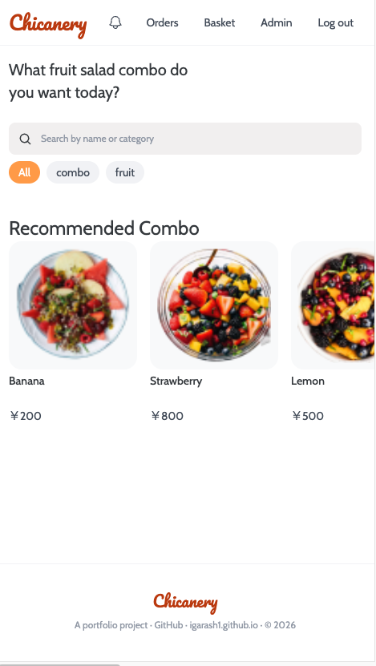
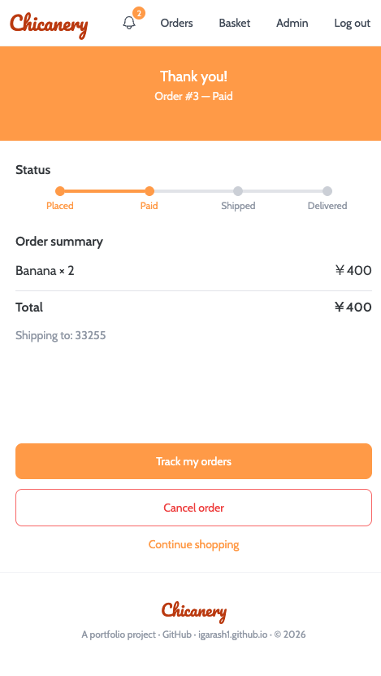
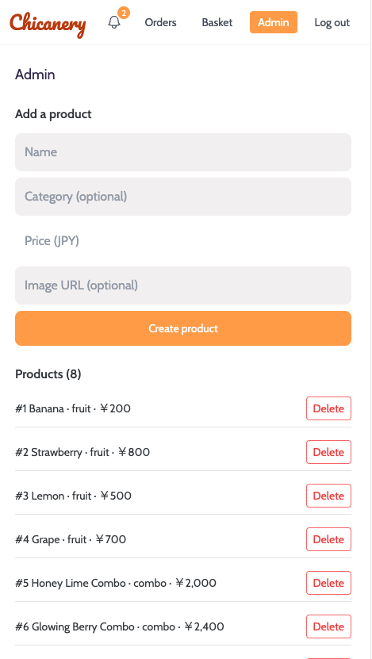
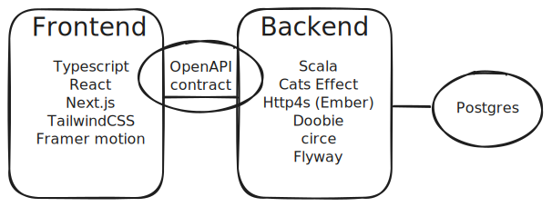

# Chicanery

[](https://github.com/polydisc/chicanery/actions/workflows/ci.yml)
[](LICENSE)

> "You think this is bad? This? This _chicanery_?"
>
> — Chuck McGill, _Better Call Saul_ (S3E5, "Chicanery")

<p align="center">
  
  
  
</p>

A small online shopping site. You can browse and search products, review them, build a cart, place and pay for an order, track shipment, and cancel before it ships. Includes an admin panel (product management, user blocking, order fulfilment) and in-app notifications.

It is a portfolio project, running locally only.

## Architecture



The OpenAPI spec (`openapi/backend-server.yaml`) is the source of truth for the
HTTP contract. Both backend and frontend sides generate code from it, enforcing type safety.

### [Frontend](frontend/README.md)

Technology: Typescript + Next.js + React + TailwindCSS

### [Backend](backend/README.md)

Technology: Scala + Http4s + Cats

### DB

Technology: PostgreSQL


## Development

Prerequisites: Docker, JDK + sbt, Node.js.

```shell
# 1. Postgres (from backend/) — creates an empty backend_db; Flyway builds the
#    schema and seeds dev data on backend startup.
cd backend
docker compose -f ./docker/postgres.yml up -d

# 2. Backend — applies migrations, serves http://localhost:8080
sbt run

# 3. Frontend (from frontend/) — http://localhost:3000
cd ../frontend
npm install
npm run dev
```

Test accounts:
- shopper `john.doe@example.com` / `password`
- admin `admin@example.com` / `password`

Regenerate the shared types after editing the OpenAPI spec:

```shell
cd backend  && sbt compile          # shopping.backend.{models,apis}.*
cd frontend && npm run gen-api-types # src/api/schema.d.ts
```

## Testing

```shell
# Backend logic tests (no database needed)
cd backend && sbt test

# Backend query analysis (needs a reachable Postgres)
RUN_DB_QUERY_CHECKS=1 sbt "testOnly shopping.backend.repository.QueryCheckSpec"

# Frontend tests (Vitest + Testing Library + MSW)
cd frontend && npm test
```

Formatting / linting: `sbt scalafmtAll` and `sbt scalafixEnable scalafixAll`
for the backend; `npm run prettier` and `npm run lint` for the frontend.

## Documentation

- [REQUIREMENTS.md](REQUIREMENTS.md) — the requirements (R1–R10) and their status.
- [STATUS.md](STATUS.md) — current state, endpoints, migrations, known limits.
- [CLAUDE.md](CLAUDE.md) / [backend/CLAUDE.md](backend/CLAUDE.md) — repo overview
  and backend FP conventions.

## License

[MIT](LICENSE)
